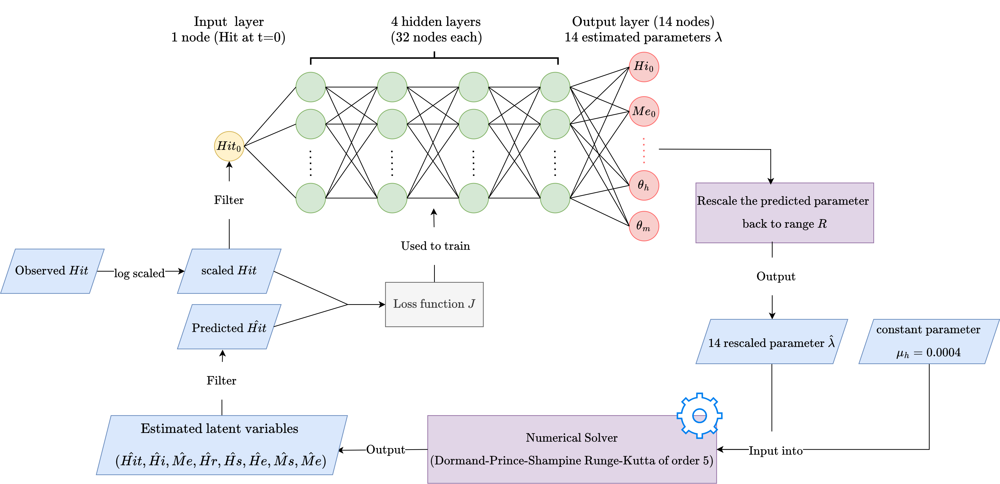

# AI Researcher 

## Technical Skills
- **Programming**: Python, SQL, Matlab, C/C++
- **Machine Learning & AI**: PyTorch, OpenCV, YOLO, UNet, Neural Network, CNN-LSTM
- **Database Management**: SQL Server, Stored Procedures
- **Cloud & Deployment**: Docker, NVIDIA Jetson (TensorRT), AWS
- **Tools & Platforms**: Git, Linux (Ubuntu), Jupyter Notebook
- **Project Management**: Agile (Scrum), Technical Writing, Publication

## Education
- M.S , Computational Engineering | Vietnamese German University, Vietnam (_Oct 2026_)
- B.S., Computer Science and Engineering | Vietnamese German Univeristy, Vietnam (_Juli 2023_)

## Work Experience
**AI Researcher @ Vietnamese German University (January 2023 - Current)**
- Conduct literature reviews and implement state-of-the-art academic papers to support ongoing research projects.
- Collect, organize, and analyze data using various statistical methods to draw insights and support research findings.
- Assist in project management by coordinating research activities, preparing presentations, and maintaining accurate records of research progress.

**Data Engineer @ FPT Software Company (Feburary 2022 - January 2023)**
- Implement SQL Server database architecture following Software Requirement Specification (SRS) and Mockup from Business analysis
- Developed stored procedures for data retrieval, cleaning, transforming, and logging between databases and web applications.
- Used Scrum for Agile project management to collaborate with cross-functional teams.

## Projects

### Neural parameters calibration for Dengue transmission modeling with real epidemic dataset from Colombia, Peru, and Puerto Rico
(On Progress)

  

- Developed and deployed Neural Network (NN) with multi-agents system to calibrate parameters for Ordinary Differential Equations (ODE) dengue modeling.
- NN shows competitive results but 25x faster regarding the speed, compared to tradition Markov Chain Monte Carlo (MCMC) traditional calibration.
- My code is developed based on open-source NeuralABM [(Github)](https://github.com/thgaskin/neuralabm). I've also added many techniques such as learning rate scheduling, gradient clipping, dropout, CNN-LSTM architecture with batchnorm, to the base code to improve the performance of Neural Network and the experiments.

**Key technologies:** Neural Network, ODE, multi-agents, CNN-LSTM

### Benchmarking Jetson Edge Devices with an End-to-end Video-based Anomaly Detection System
([Publication](https://link.springer.com/chapter/10.1007/978-3-031-53963-3_25)) ([Github](https://github.com/Hoangpham13579/end_to_end_anomaly_detection))

  
  

- Developed and deployed an AI-based anomaly detection system on Jetson edge devices, achieving 84.39% AUC on UCF-Crime and 88.4% AUC on UIT_VNAnomaly datasets.
- Optimized deep learning deployment with TensorRT and Docker, fine-tuning models to achieve 47.56 FPS with 3.11 GB RAM usage on edge devices.
- Benchmarked deep learning models on NVIDIA Jetson platforms, improving performance by 15% while reducing energy consumption by 50%.

**Key technologies:** RTFM (video-based anomaly detection), slowfast, Jetson Edge devices, torch tensorRT

### Water Body Detection Using UAV Multispectral Imagery
([Under Review](https://www.researchsquare.com/article/rs-3950831/v1)) ([Github](https://github.com/Hoangpham13579/WaterMAI))

- Collect and construct the high-quality WaterMAI dataset (880 images), optimized for small and medium-sized UAV-based water body detection.
- Evaluated deep learning models UNet, MSNet, Yolov7, Yolov7x using bounding box and segmentation approaches, achieving Dice scores > 0.92
- Optimized spectral input combinations (RGB, NIR, NDWI) to enhance model accuracy for environmental monitoring.

**Key technologies:** UNet (segment), MSNet (segment), Yolov7 (bbox), Active Learning (for segment/bbox data labeling), multi-spectral processing

### PM2.5 Concentration Prediction Using Traffic Surveillance
([Publication](https://ieeexplore.ieee.org/document/10013864))

  
  

- Benchmarked object detection models YOLOv5, SSD, Mask-RCNN for vehicle counting to estimate PM2.5 level from specific formula. 
- The final result shows 0.9 Pearson correlation between traffic density and PM2.5 levels.

**Key technologies:** Yolov5, SSD, Mask_RCNN, data labeling, Kalman Filter (tracking algo)

## Publications
1. **Pham, H.V.**, Tran, T.G., Le, C.D., Le, A.D., Vo, H.B. (2024). Benchmarking Jetson Edge Devices with an End-to-End Video-Based Anomaly Detection System. In: Arai, K. (eds) Advances in Information and Communication. FICC 2024. Lecture Notes in Networks and Systems, vol 920. Springer, Cham. https://doi.org/10.1007/978-3-031-53963-3_25
2. C. D. Le, **H. V. Pham**, D. A. Pham, A. D. Le and H. B. Vo, "A PM2.5 concentration prediction framework with vehicle tracking system: From cause to effect," 2022 RIVF International Conference on Computing and Communication Technologies (RIVF), Ho Chi Minh City, Vietnam, 2022, pp. 714-719, doi: 10.1109/RIVF55975.2022.10013864.
3. **(UNDER REVIEW)** Ngo Phuc Linh, **Pham Viet Hoang**, Bui Ngoc Long, Vo Bich Hien, Thirumalaisamy P. Velavan, Tran Duc
Khanh. Use of low-cost drones to map arbovirus vector habitats with multispectral aerial imagery, 14 February 2025
4. **(ON PROGRESS)** **Pham Viet Hoang**, Nguyen Trung Dang Khuong, Thirumalaisamy P. Velavan, Tran Duc Khanh. Neural
parameters calibration for Dengue transmission modeling with real epidemic dataset from Colombia, Peru, and Puerto Rico, 08 April
2025
